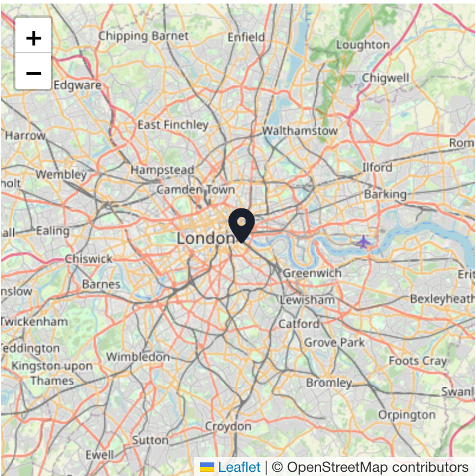
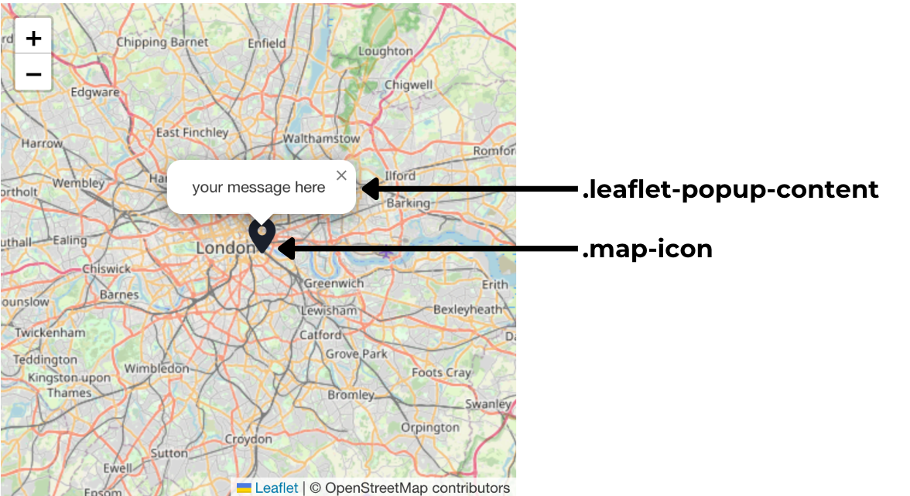
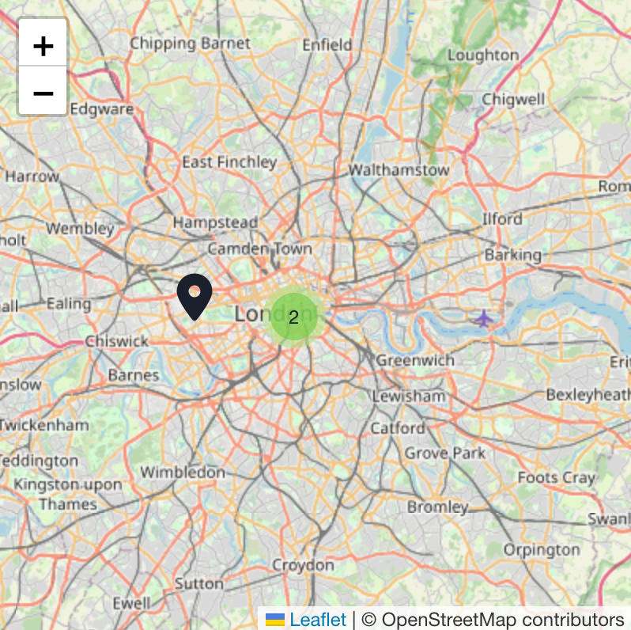

# Overview

Map Component for Qodly studio using [leaftletJs](https://leafletjs.com) and [OpenStreetMAp](https://www.openstreetmap.org/#map=6/31.885/-7.080)

## Uni marker Map

The Uni-Marker Map Component is a mapping feature designed to display a single marker on a map, typically representing a specific location or point of interest.



| Name            | Type    | Description                                                                |
| --------------- | ------- | -------------------------------------------------------------------------- |
| Zoom            | Number  | Initial map zoom level                                                     |
| Map dragging    | Boolean | Whether the map is draggable with mouse touch or not.                      |
| Popup           | Boolean | If true, opens a popup with a given message in the given point on the map. |
| Marker dragging | Boolean | Whether the marker is draggable with mouse touch or not.                   |
| Marker Icon     | Icon    | the marker icon                                                            |

### QodlySource

| Name       | Type             | Required | Description                          |
| ---------- | ---------------- | -------- | ------------------------------------ |
| QodlySource | Object or Entity | Yes      | Your data                            |
| Longitude  | Number           | yes      | The longitude path in the qodlysource |
| Latitde    | Number           | yes      | The latitude path in the qodlysource  |
| Tooltip    | Text             | No       | The tooltip path in the qodlysource   |

Some example of data in the case of Object qodlysource :

```
{"latitude" : 31.792305849269,"longitude" : -7.080168000000015}
{"latitude" : 31.792305849269,"longitude" : -7.080168000000015, "popupMessage": '<div><p>This is your location</p></div>' }

```

### Custom Css

When customizing the appearance of the map, you have access to the popup message and icon class :


## Multi marker Map

The Multi-Marker Map Component is a feature commonly used in mapping applications to display multiple markers on a single map. It provides a way to visualize various points of interest, locations, or data points on a geographic map.



| Name                  | Type    | Description                                                                 |
| --------------------- | ------- | --------------------------------------------------------------------------- |
| Zoom                  | Number  | Initial map zoom level                                                      |
| Show All Markers                  | Boolean  | if true it will show all the markers in the map at once                                                     |
| Map dragging          | Boolean | Enables or disables dragging of the map with mouse or touch                 |
| Animation             | Boolean | Determines whether map view transitions are animated when changing position |
| Popup                 | Boolean | If true, opens a popup with a given message in the given point on the map.  |
| Marker group distance | number  | the distance between the markers of the created group (in Km)               |
| Marker Icon           | Icon    | the marker icon                                                             |

### DataSource

| Name             | Type                     | Required | Description                                                                     |
| ---------------- | ------------------------ | -------- | ------------------------------------------------------------------------------- |
| QodlySource       | Array or EntitySelection | Yes      | Your data                                                                       |
| Current Position | Object or Entity         | No       | The currently selected pin on the map, representing the user's chosen location. |
| Longitude        | Number                   | Yes      | The longitude path in the qodlysource                                            |
| Latitde          | Number                   | Yes      | The latitude path in the qodlysource                                             |
| Tooltip          | Text                     | No       | The tooltip path in the qodlysource                                              |

Some example of data in the case of Array qodlysource:

```
[{"latitude" : 31.792305849269,"longitude" : -7.080168000000015},{"latitude":51.505,"longitude":-0.09, "popupMessage": '<div><p>This is your location</p></div>'},...]

```
